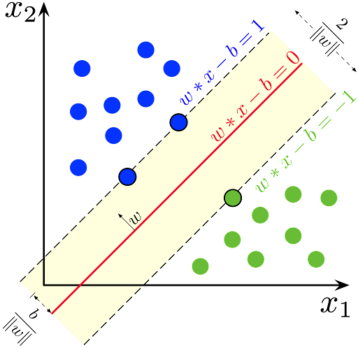

# Support vector machine {#svm}

@Cortes1995 en el artículo titulado "Support-Vector Networks" propusieron las máquinas de soporte vectorial (svm) para el problema de clasificación.

Abajo se muestra una ilustración del método.

```{r rmarkdown, echo=FALSE, out.width='60%', fig.align='center', fig.cap='Ilustración de svm.'}

```

